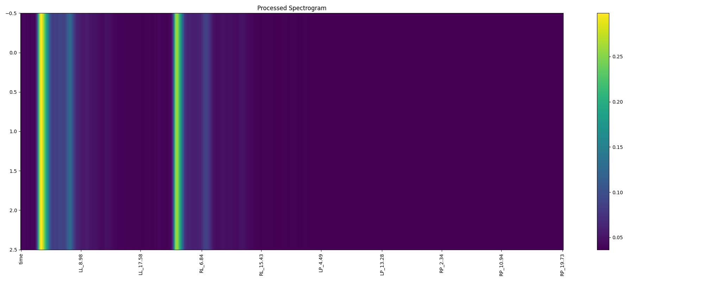
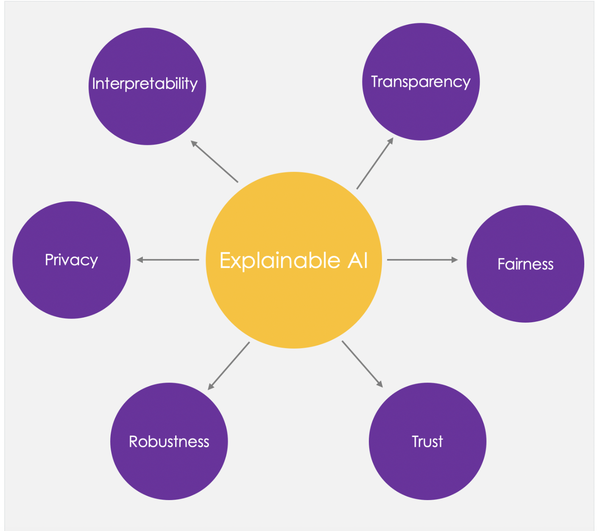
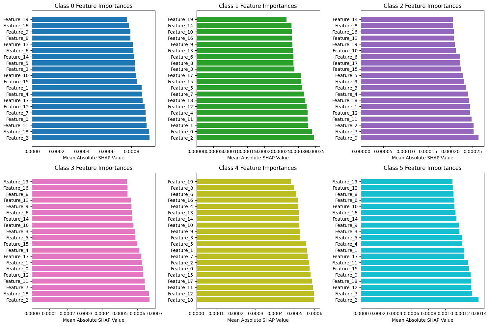

# Brain Pattern Identification using Multimodal Classification and Explainable AI
This research project aims to develop a multi-modal classification model that classifies seizures into different categories, by analyzing patient EEG scans and Spectrogram data. XAI and multimodal classification models are particularly well-suited for handling complex time series data such as EEG and spectrograms in medical modeling. These models excel by integrating multiple data types, enhancing the robustness and accuracy of medical diagnostics.

XAI plays a pivotal role by making these sophisticated models transparent, allowing healthcare professionals to see and understand how conclusions are derived from time series data. The theory is that a multimodal approach can more accurately pinpoint seizure activities or other neurological abnormalities. XAI adds value by providing clear explanations of the AI's decision-making process, ensuring that these complex analyses are accessible and justifiable to clinicians.

This synergy of multimodal modeling with XAI not only pushes the boundaries of what is achievable in medical diagnostics but also builds trust and facilitates wider adoption of AI technologies in clinical settings.

