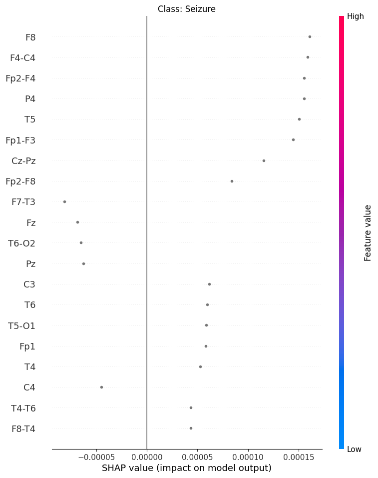

# XAI IN HARMFUL BRAIN PATTERN IDENTIFICATION USING EEG AND SPECTROGRAM DATA

The Brain Pattern Identification Project investigates the efficacy of a multimodal model combining EEG and spectrogram data for seizure classification. As illustrated in the performance curves (Figure 1), the multimodal model already outperforms unimodal approaches, achieving better accuracy and lower loss in both training and validation.

 To further enhance its performance, this research explores the inclusion of augmented EEG data generated by the DiffEEG architecture (Figure 2).
 
 
 
 
DiffEEG  ([Data Augmentation for Seizure Prediction
with Generative Diffusion Model](https://arxiv.org/pdf/2306.08256)) employs a diffusion-based process to generate realistic EEG waveforms, providing a novel approach to data augmentation in the context of multimodal learning. 

A key objective of this project is to evaluate whether the augmented EEG data can further improve the classification accuracy of the multimodal model. To gain deeper insights, Explainable AI (XAI) techniques such as SHAP are applied to analyze the model’s decision-making process. Initial SHAP results on the multimodal model without augmentation (Figure 3) highlight the contributions of various EEG channels to the model’s predictions. 

 

By applying SHAP analysis to the augmented model, the aim is to determine how the additional data influences the model’s feature importance and whether it enhances its interpretability and reliability for clinical applications.

This comprehensive approach—combining performance evaluation, data augmentation through DiffEEG, and XAI analysis—seeks to advance the field of seizure classification by leveraging state-of-the-art machine learning techniques and addressing the challenges of data scarcity and model transparency.